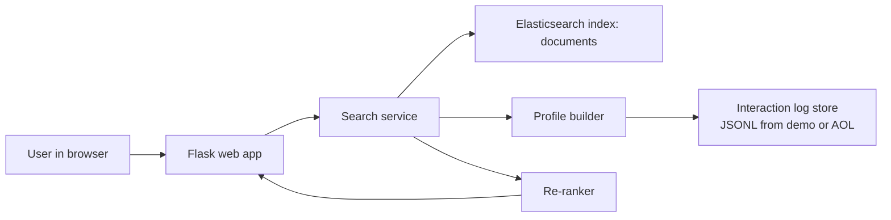

# Baseline system architecture

## Components

### 1. Document index
Stored in Elasticsearch.

Each document has:
- title
- content
- topics
- domain
- url

### 2. Interaction log store
Stored separately as JSONL.

Each interaction has:
- user_id
- query
- timestamp
- clicked
- clicked_rank
- clicked_domain

### 3. User profile builder
Builds a simple profile from a user's past interactions:
- weighted query terms
- weighted clicked domains

### 4. Search service
Does two things:
- retrieve top candidates with Elasticsearch BM25
- re-rank them using profile overlap

## Why this separation matters

This is the key idea in personalized search:
- **documents** live in a searchable index
- **behavior** lives in logs
- **personalization** is computed from the logs and applied to retrieval results

That is the conceptual baseline you should understand before moving to session models, learning-to-rank, or evaluation.
