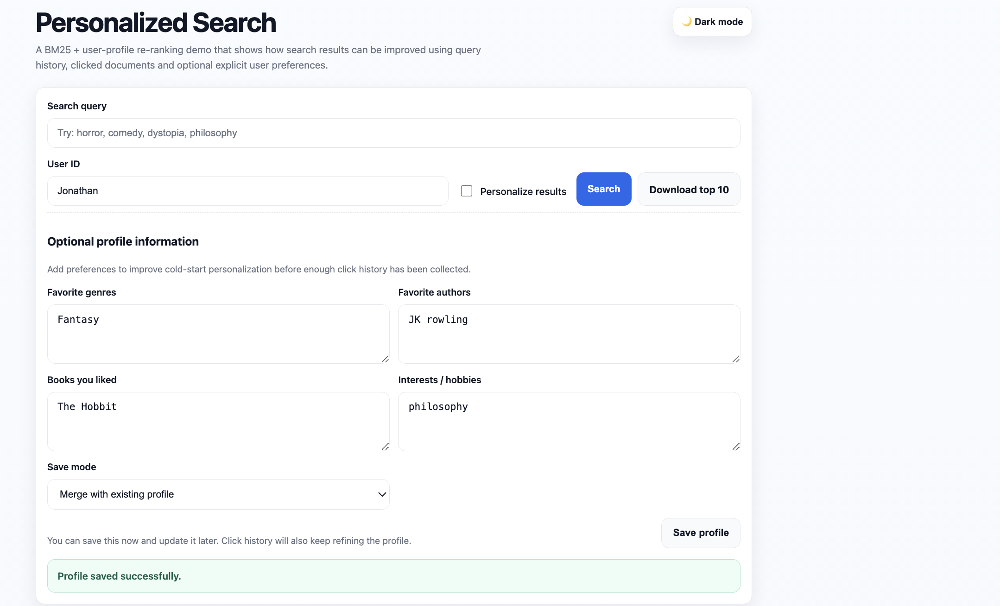
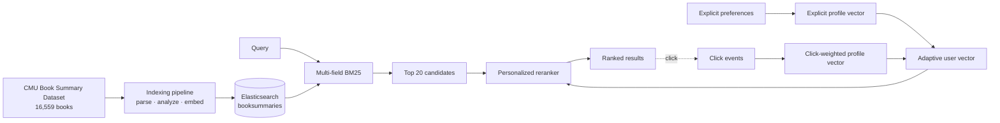
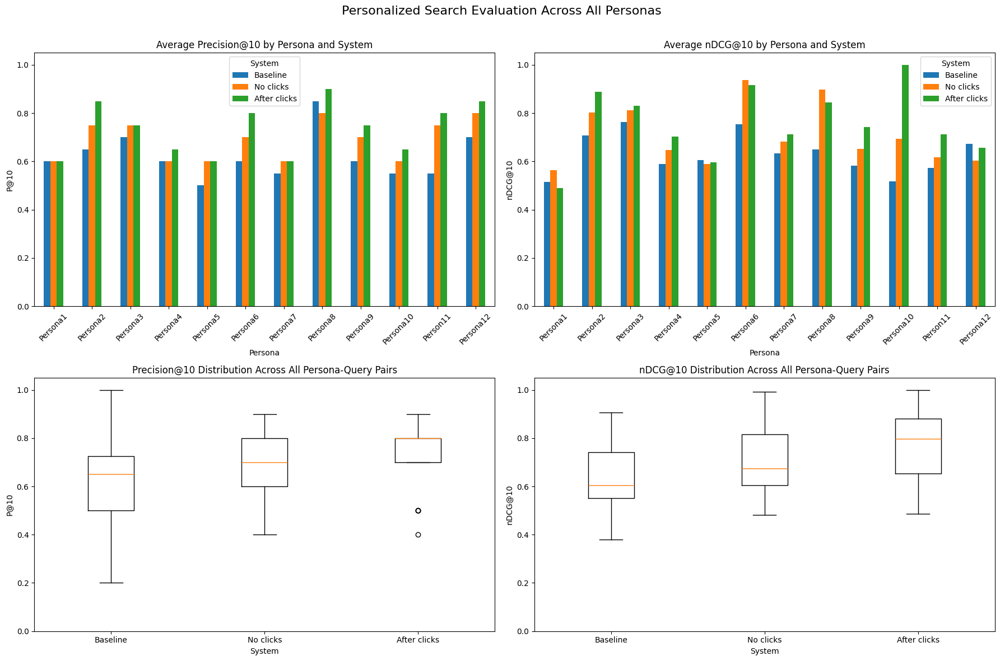

<h1 align="center">Personalized Book Search Engine</h1>

<p align="center">
  A two-stage information retrieval system that combines lexical relevance, semantic similarity, explicit preferences, and click feedback.
</p>

<p align="center">
  
  
  
  
</p>

<p align="center">
  <a href="Personalized_Search_Project_Report.pdf">Technical report</a> ·
  <a href="ProjectFolder/EvaluationFolder/eval.ipynb">Evaluation notebook</a> ·
  <a href="https://www.cs.cmu.edu/~dbamman/booksummaries.html">Dataset</a>
</p>

## Table of contents

- [Overview](#overview)
- [Interface](#interface)
- [System architecture](#system-architecture)
- [Ranking model](#ranking-model)
  - [Candidate retrieval](#candidate-retrieval)
  - [Semantic representations](#semantic-representations)
  - [User model and cold start](#user-model-and-cold-start)
  - [Click feedback](#click-feedback)
  - [Personalized reranking](#personalized-reranking)
- [Evaluation](#evaluation)
- [Installation](#installation)
- [Repository structure](#repository-structure)
- [Limitations](#limitations)

## Overview

The engine searches 16,559 records from the CMU Book Summary Dataset. Elasticsearch first retrieves lexically relevant candidates with BM25. A second stage then reranks those candidates using metadata preferences, click history, and semantic similarity from `all-MiniLM-L6-v2` embeddings.

The implementation includes:

- boosted BM25 retrieval over title, author, summary, and genre;
- normalized 384-dimensional embeddings for queries, summaries, and user profiles;
- explicit preferences for genres, authors, books, and free-text interests;
- implicit profiles derived from clicked documents, genres, and authors;
- an adaptive transition from cold-start preferences to behavioral evidence;
- an interpretable seven-component reranking function;
- a Flask interface for search, profile management, click logging, and result export; and
- a reproducible evaluation using P@10 and nDCG@10.

## Interface

Users may save an explicit profile before any interaction history exists. New values can replace the stored profile or be merged with it.

<p align="center">
  
</p>

<p align="center"><sub>Explicit profile entry for cold-start personalization.</sub></p>

Search results display book metadata and score information. The profile panel exposes both saved preferences and click-derived signals, making profile updates observable.

<p align="center">
  
</p>

<p align="center"><sub>Search results with the persisted user profile and learned interaction signals.</sub></p>

## System architecture



Three Elasticsearch indices separate retrieval, profile state, and event history:

| Index | Contents |
|---|---|
| `booksummaries` | Searchable metadata, analyzed summaries, and document vectors |
| `user_profiles` | Explicit preferences, profile vectors, click counts, and recent queries |
| `user_logs` | Append-only click events with user, query, document, and timestamp data |

## Ranking model

### Candidate retrieval

Elasticsearch executes `multi_match` in `best_fields` mode over the following fields:

```text
title^3, author^2, summary, genres
```

For query term $t$, document $d$, and query $q$, the lexical score follows BM25:

$$
s_{\mathrm{BM25}}(q,d)
= \sum_{t \in q}\mathrm{IDF}(t)
\frac{f(t,d)(k_1+1)}
{f(t,d)+k_1\left(1-b+b\frac{|d|}{\mathrm{avgdl}}\right)}.
$$

Non-personalized searches return this ranking directly. Personalized searches retrieve $K=20$ candidates for second-stage scoring.

### Semantic representations

Let $E(\cdot): \text{text} \rightarrow \mathbb{R}^{384}$ denote `all-MiniLM-L6-v2`. All vectors are L2-normalized. A document vector is computed from the first 500 characters of its summary:

$$
\mathbf d = E(\text{"Summary: "} \Vert \operatorname{truncate}_{500}(\text{summary})).
$$

The query vector is $\mathbf q=E(q)$. Semantic features use cosine similarity, clamped at zero so that negative similarity cannot reduce a score.

### User model and cold start

The explicit profile text concatenates favorite genres, authors, books, and interests:

$$
T_{\mathrm{exp}}=\operatorname{concat}(G_u,A_u,B_u,I_u),
\qquad
\mathbf u_{\mathrm{exp}}=E(T_{\mathrm{exp}}).
$$

For the implicit profile, let $c_i$ be the number of clicks on document $d_i$. The engine selects the 30 most-clicked documents and computes:

$$
\mathbf u_{\mathrm{click}}
=\operatorname{normalize}\left(\sum_{i=1}^{30}c_i\mathbf d_i\right).
$$

When both vectors exist, the total click count $n$ controls their contribution:

$$
\alpha_{\mathrm{exp}}=\frac{5}{n+5},
\qquad
\alpha_{\mathrm{click}}=\frac{n}{n+5},
$$

$$
\mathbf u
=\operatorname{normalize}\left(
\alpha_{\mathrm{exp}}\mathbf u_{\mathrm{exp}}
+\alpha_{\mathrm{click}}\mathbf u_{\mathrm{click}}
\right).
$$

The constant 5 acts as a small prior for the explicit profile. At five clicks, explicit and implicit vectors receive equal weight.

| Available evidence | User representation | Ranking behavior |
|---|---|---|
| No profile, no clicks | No user vector | BM25 and query–document semantics only |
| Explicit profile only | $\mathbf u=\mathbf u_{\mathrm{exp}}$ | Full cold-start preference matching |
| Click history only | $\mathbf u=\mathbf u_{\mathrm{click}}$ | Behavioral personalization only |
| Explicit profile and clicks | Adaptive blend above | Gradual transition toward observed behavior |

### Click feedback

A result click produces two updates:

1. An immutable event is appended to `user_logs` with the query, document, metadata, and timestamp.
2. The corresponding `user_profiles` document increments the document, genre, author, and total click counts.

Genre and author counts are normalized into preference distributions. For genre $g$:

$$
p(g\mid u)=\frac{c_u(g)}{\sum_{g'}c_u(g')}.
$$

The same normalization is applied to authors. Repeated clicks on the same document receive a damped bonus:

$$
s_{\mathrm{repeat}}(d,u)
=1.6\,\alpha_{\mathrm{click}}\log\left(1+c_u(d)\right).
$$

Recent queries are stored for inspection but are not used as preference signals because a query may be exploratory or unsuccessful. Click evidence affects subsequent searches; it does not reorder the page already being viewed.

### Personalized reranking

Within the candidate set, the strongest BM25 score is scaled to 10:

$$
\widetilde{s}_{\mathrm{BM25}}(q,d)
=10\frac{s_{\mathrm{BM25}}(q,d)}
{\max_{d'\in D_K(q)}s_{\mathrm{BM25}}(q,d')}.
$$

The final score is additive and therefore directly inspectable:

$$
S(q,d,u)=
\widetilde{s}_{\mathrm{BM25}}
+s_{\mathrm{genre}}
+s_{\mathrm{author}}
+s_{\mathrm{book}}
+s_{\mathrm{repeat}}
+s_{\mathrm{qsem}}
+s_{\mathrm{usem}}.
$$

| Component | Definition | Weight |
|---|---|---:|
| BM25 | Candidate-normalized lexical relevance | 10.0 |
| Genre | Explicit match / normalized click preference | 2.2 / 2.8 |
| Author | Explicit match / normalized click preference | 1.8 / 2.2 |
| Favorite book | Exact, substring, or Dice title overlap | 2.0 |
| Repeat click | Log-damped document click count | 1.6 |
| Query–document semantics | $\max(0,\cos(\mathbf q,\mathbf d))$ | 4.0 |
| User–document semantics | $\max(0,\cos(\mathbf u,\mathbf d))$ | 8.0 |

Explicit and click-derived metadata features are multiplied by $\alpha_{\mathrm{exp}}$ and $\alpha_{\mathrm{click}}$, respectively. This keeps the metadata bonuses consistent with the vector blend.

## Evaluation

Twelve synthetic personas were evaluated. Each persona contains four explicit preference fields, three warm-up queries for click generation, and two test queries. Each test query was run under three conditions: BM25 baseline, explicit profile without clicks, and explicit profile with click feedback. Results were pooled and assigned graded relevance labels before calculating P@10 and nDCG@10.

| Condition | Avg. P@10 | Avg. nDCG@10 |
|---|---:|---:|
| Baseline | 0.621 | 0.630 |
| Explicit profile, no clicks | 0.688 | 0.708 |
| Explicit profile with clicks | **0.733** | **0.757** |

<p align="center">
  
</p>

The evaluation is exploratory: personas are synthetic, relevance judgments are manually assigned, and reranking weights are not learned. The [technical report](Personalized_Search_Project_Report.pdf) contains the full experimental design and per-query results.

## Installation

### Prerequisites

- Python 3.10+
- Docker Desktop
- macOS, Linux, or WSL

### 1. Clone and install dependencies

```bash
git clone --branch Jonathan_Branch --single-branch https://github.com/NeguseNegest/Personalized_Search.git
cd Personalized_Search

python3.10 -m venv .venv
source .venv/bin/activate
python -m pip install -r requirements.txt sentence-transformers
```

### 2. Start Elasticsearch

```bash
curl -fsSL https://elastic.co/start-local | sh
```

For later sessions:

```bash
./elastic-start-local/start.sh
```

### 3. Index the collection

```bash
cd ProjectFolder
python indexer.py
```

Embedding generation uses batches of 32; Elasticsearch bulk operations use chunks of 200. Initial indexing generally takes 5–10 minutes, depending on hardware.

### 4. Run the application

```bash
python app.py
```

Open [http://127.0.0.1:5000](http://127.0.0.1:5000).

If `localhost:9200` refuses the connection, start Docker Desktop and run `./elastic-start-local/start.sh` from the repository root. From inside `ProjectFolder`, use `../elastic-start-local/start.sh`.

### Reproduce the evaluation

```bash
cd ProjectFolder/EvaluationFolder
jupyter lab eval.ipynb
```

## Repository structure

```text
Personalized_Search/
├── ProjectFolder/
│   ├── app.py                  # Flask routes and result export
│   ├── indexer.py              # Parsing, embedding, and bulk indexing
│   ├── search_engine.py        # BM25 retrieval and personalized reranking
│   ├── user_profiles.py        # Explicit and implicit user models
│   ├── user_logs.py            # Append-only click logging
│   ├── embeddings_utils.py     # MiniLM encoding and vector operations
│   ├── es_mappings.py          # Elasticsearch index definitions
│   ├── Website/index.html      # Search interface
│   ├── Corpus/                 # CMU book summaries
│   └── EvaluationFolder/       # Notebook and labeled persona files
├── docs/assets/                # README figures and screenshots
├── Personalized_Search_Project_Report.pdf
└── Personalized_Search_Project_Report.tex
```

## Limitations

- The reranker operates on the top 20 BM25 candidates, so documents missed during lexical retrieval cannot be recovered.
- Feature weights are manually configured rather than learned from held-out judgments.
- Clicks are treated as positive evidence without explicit correction for position or presentation bias.
- The evaluation uses synthetic personas rather than production interaction logs.

Potential extensions include dense candidate retrieval, learned reranking weights, confidence-aware click modeling, and evaluation with real users.
